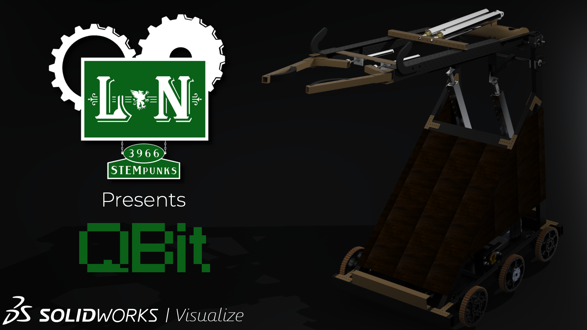

# The2018Thing

Our robot code for the FIRST Robotics *FIRST Power Up* competition.



 

## Getting Started
### Prequisites
Our repo requires on the following Python libraries:
* [RobotPy](https://robotpy.readthedocs.io)
* [OpenCV](https://opencv.org/)
* [NumPy](www.numpy.org)

### Installation
#### Linux/MacOS

> run `pip3 install -r requirements.txt`

> May require `sudo`, but `--user` can be passed in if need be.


#### Windows
> `pip3 install -r requirements.txt`

#### Test Modules
Run the following commands in your local Python terminal (Run `python3` or `python` to access it):
```
    >>> import cv2
    >>> import wpilib
    >>> import numpy
```
These should return no errors. If they did, review previous instructions.

### Test Code
To test this robot project, simply pass in the following command into your command prompt.
```
$ python3 {path to robot.py folder} sim
```
or, if you use Windows, 
```
$ python {path to robot.py folder} sim
```
This should bring up a separate window to display a test bench on. 
